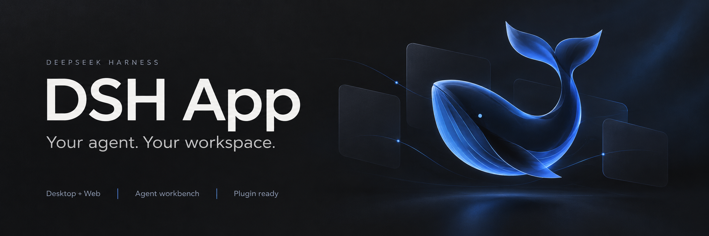
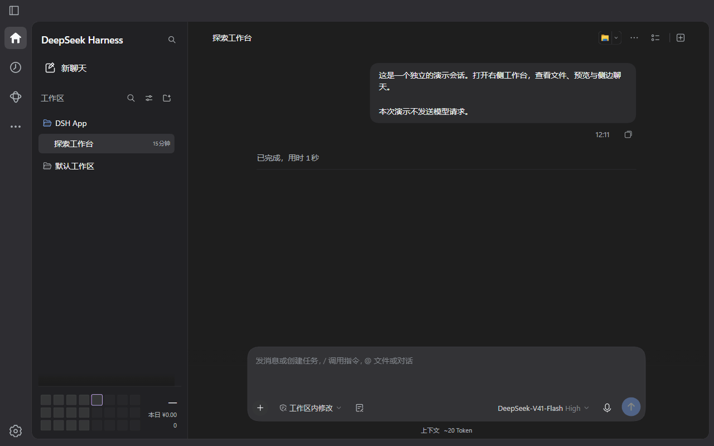
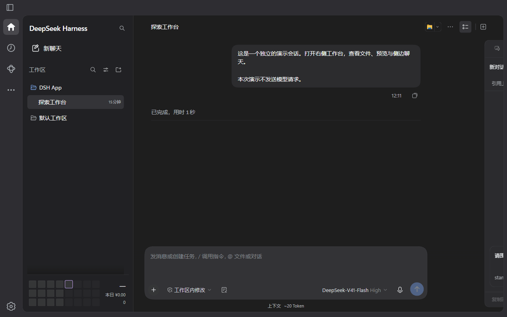
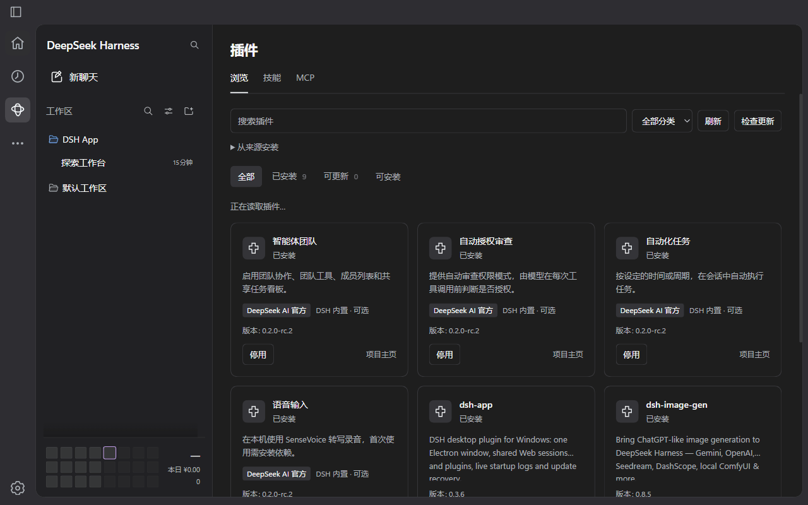

<p align="center">
  
</p>

<h1 align="center">DSH App</h1>
<p align="center"><strong>让对话、文件和 Agent，在同一个工作台中协作。</strong></p>
<p align="center">为 DeepSeek Harness 打造的 Codex 风格客户端 · Windows 桌面 + Web</p>
<p align="center"><strong>简体中文</strong> · <a href="README.en.md">English</a> · <a href="https://github.com/CaT-Hode/DSH-app/releases">版本下载</a> · <a href="https://github.com/CaT-Hode/DSH-app/issues">反馈问题</a></p>
<p align="center">
  <a href="https://github.com/CaT-Hode/DSH-app"></a>
  
  
  <a href="LICENSE"></a>
</p>
<p align="center"><a href="#界面演示">界面演示</a> · <a href="#有什么不同">核心特色</a> · <a href="#快速开始">快速开始</a> · <a href="#插件兼容与迁移">插件兼容</a> · <a href="#常见问题">常见问题</a></p>

DSH App 把 DSH 的对话、项目、文件和扩展整合成一个完整工作台。桌面窗口和浏览器连接同一个 `web` profile，继续使用已有的模型、会话与兼容插件。右侧工作台可以由你打开，也可以由当前对话的 Agent 控制。

这是社区维护的 DSH 插件，拥有自己的界面与 Electron 桌面壳。Codex 是交互设计参考；DSH App 不依赖 Codex UI 插件，也不是 DeepSeek 官方桌面客户端。

## 界面演示

### 一个画布，按需展开工作台

右侧浮栏显示输出、会话信息与工作内容。展开时为正文留出阅读空间，收起后恢复居中；新聊天默认隐藏工作台。文件、预览和侧边聊天通过同一个工具入口打开。



### 插件页面和设置，在同一处

左侧 `…` 汇集第三方扩展页面。独立设置以同行齿轮打开；只有一个页面的插件直接进入，不显示重复设置按钮。



### 技能与 MCP，也属于工作流

在统一插件中心切换浏览、技能和 MCP，无需在多个管理插件之间来回寻找。



<details>
<summary>演示素材说明</summary>

这些 GIF 录自当前 DSH App 客户端，使用独立的 DSH `0.2.0-rc.2` 演示配置、示例工作区与本地准备的演示会话，不含个人对话或 API Key。侧边聊天仅展示草稿，不发送模型消息。播放经过停顿与节奏调整，用于说明操作，不代表性能测试。标题图为生成的品牌插画；GIF 展示实际界面。

[素材来源与录制说明](docs/assets/readme/README.md)

</details>

## 有什么不同

### 对话与工作内容，共用一张画布

导航轨、项目侧栏、顶栏、输入框和悬浮工作台采用统一的石墨灰层次，支持深浅外观。正文与工作台协调布局，减少独立分栏对对话空间的挤压。鲸鱼欢迎页会根据项目显示「我们应该在 *项目名* 中做些什么？」，未选择项目时显示「探索未至之境」。

### 文件、预览与 Git，随对话打开

内置文件树、搜索、上传、ZIP 下载、CodeMirror 编辑、Markdown / Mermaid / HTML / 网页预览，以及 Git 与本轮 AI 改动。保留 Better Sidebar 的扩展接口，同时重做工作台布局、起始页与设置。打开的内容随所属对话恢复，不需要另装原侧栏插件。

### Agent 可以把相关内容带到你面前

启用「允许 Agent 控制侧栏」后，Agent 可打开文件并定位行号、展示网页或扩展标签、读取标签状态、切换内容和收起工作台。命令绑定当前对话，客户端返回实际执行确认；打开侧边聊天的草稿和引用不会自动发送消息。

```js
// 定位当前工作区中的文件
sidebar_open_view({ target: "src/main.ts", line: 20 })

// 准备一个侧边审阅草稿，交给用户继续编辑
sidebar_open_view({
  target: "sidechat", type: "tab", title: "代码审阅",
  draft: "请帮我审阅当前改动",
  context: [{ title: "关注点", text: "重点检查异常处理和边界条件" }]
})
```

| Agent 工具 | 能力 |
| --- | --- |
| `sidebar_open_view` | 打开文件、文件夹、网页、DSH resource 或已注册标签 |
| `sidebar_get_tabs` | 查看实际标签、可用内容、显示状态和连接状态 |
| `sidebar_activate_tab` | 激活标签并显示工作台 |
| `sidebar_close_tab` | 关闭指定标签 |
| `sidebar_set_visibility` | 显示或收起工作台，保留内容 |

完整行为、确认状态和扩展接口见 [内置侧栏工作台](lib/sidebar/README.md)。

### 侧边聊天，是可以继续使用的独立对话

Side Chat 支持多个会话、历史记录、重命名、独立草稿和上下文引用。可以引用主对话草稿、选中文本或打开的文件；回答可复制、加入主对话草稿，或转为可继续的主对话。保留流式回答、思考、工具、子 Agent、停止及断线恢复。

主对话后续消息不会自动同步到已创建的 Side Chat，草稿和引用由你确认后发送。刷新或重启后可以恢复已打开的侧边对话。

### 插件兼容，不只是多放一个按钮

支持第三方 `settings.section` 与 `settings.plugins.tab` 栏目，使用原生表单和控制器；合并可确认归属的页面与设置，避免重复入口。只有单页的插件不显示齿轮，多个设置页面提供选择菜单。插件注册、停用与卸载后，菜单随生命周期更新。

内置市场将官方插件置顶并标明来源、版本与内置可选状态。安装、更新和卸载先进入可取消待办，重启后由官方 CLI 应用，并保留备份和失败恢复记录。

### 技能、MCP、用量，都有清晰入口

| 能力 | 可以做什么 |
| --- | --- |
| **技能** | 浏览、创建、编辑、启停和导入技能；连接本机与项目技能库，删除后可恢复 |
| **MCP** | 管理连接、目录、OAuth、自定义服务、工具调用策略、项目范围与备份恢复 |
| **费用与用量** | DeepSeek 官方余额、本地用量账本、Token 热力图、模型价格、历史费用与预算 |
| **当前会话洞察** | 上下文占用与组成、请求趋势、工具耗时、失败和压缩活动 |
| **桌面维护** | 单实例与托盘、窗口内启动日志、诊断、重试和有备份支持的更新恢复 |

技能和 MCP 保留在插件中心，费用与用量保留独立入口，不与第三方扩展的 `…` 菜单重复。

## 快速开始

### 环境准备

- **Windows**、**Node.js 24+**、**pnpm 11**。
- 已安装 [DeepSeek Harness](https://github.com/deepseek-ai/deepseek-harness)，终端可运行 `dsh`。
- 当前插件版本 **0.3.6**，客户端验证基线 **DSH 0.2.0-rc.2**，Electron **44**。其他核心版本需重新验证接口兼容性。
- 若已安装旧的侧栏、Codex UI、市场、MCP 或费用插件，先阅读下方迁移说明。

### 1. 安装到现有 Web profile

```powershell
dsh plugin --profile web add 'git+https://github.com/CaT-Hode/DSH-app.git'
```

使用 GitHub 安装源，也可把 Releases 中的 `.tgz` 路径传给同一条命令。本项目目前不以 npm 发布包作为安装源。

### 2. 完成首次激活

```powershell
dsh --profile web --no-open
```

等待 Web 服务就绪，再按 `Ctrl+C` 停止。插件会记住 DSH 的启动入口。

### 3. 打开桌面客户端

```powershell
$dshData = if ($env:DSH_HOME) { $env:DSH_HOME } else { Join-Path $HOME '.dsh' }
& (Join-Path $dshData 'profiles\web\node_modules\.bin\dsh-app.cmd')
```

之后直接执行第三步即可启动。首次在 **设置 → 模型** 配置模型，并添加工作目录。关闭窗口会驻留托盘，完全退出请使用托盘菜单或 `dsh-app --quit`。

<details>
<summary>交给本地 Agent 安装</summary>

```text
请按 https://github.com/CaT-Hode/DSH-app 的 README，把 DSH App 安装到我的 web profile。验证 Node.js 24+、pnpm 11 和 DSH 核心版本，备份现有 profile，对照迁移表处理重复插件，保留模型、会话、MCP 存储、技能和账本。使用 GitHub 安装源，启动一次 Web 完成激活，再打开 dsh-app.cmd。不要删除 DSH 数据目录。
```

</details>

## 插件兼容与迁移

以下功能已内置，**不要在同一个 profile 同时启用原插件**。只隐藏按钮可能留下重复路由、服务或监听器；迁移前备份配置与数据，DSH App 不会自动卸载原插件。

| 已内置的原插件 | 新入口 |
| --- | --- |
| `dsh-better-sidebar` | 右侧工作台：文件、Git、预览与 Side Chat |
| `@michengai/dsh-codex-ui` | 自有导航轨、项目侧栏、顶栏与对话布局 |
| `dshmarket` | 插件 → 浏览 |
| `dsh-mcp-connector` | 插件 → MCP |
| `dsh-cost-meter` / `dsh-context` | 费用与用量 / 当前会话 |
| `@linxin666/dsh-client-ui-skill-explorer` / `@michengai/dsh-skills-manager` | 插件 → 技能 |

[完整冲突说明与数据迁移步骤](docs/compatibility.zh.md) · [许可证与来源](NOTICE.md)

已实机验证的扩展示例：

| 插件 | 验证范围 |
| --- | --- |
| `@zzerx/dsh-plugin-notes` **0.4.2** | 页面与同行设置齿轮 |
| `@linxin666/dsh-client-ui-task-board` **0.4.4** | 页面、草稿创建与删除、停用与恢复 |
| `@linxin666/dsh-client-ui-git-graph` **0.4.4** | 真实项目分支与提交历史读取 |
| `dsh-image-gen` **0.8.5** | 原生 Provider 设置、单页入口、停用与恢复 |

这些是具体版本的兼容记录，不覆盖所有社区插件。图像生成验证未发起生图请求，任务看板验证未执行模型任务。

## 常见问题

<details>
<summary>桌面和 Web 会产生两份对话吗？</summary>

不会。连接同一个后端和 `web` profile 时，两种界面使用同一份会话、模型和插件配置。顶栏或托盘菜单可在浏览器中打开当前服务。

</details>

<details>
<summary>安装成功，但 Electron 窗口打不开？</summary>

Electron 是可选依赖，首次下载需要联网。确认包管理器没有阻止其安装脚本；也可以用 `DSH_APP_ELECTRON` 指向兼容的 `electron.exe`。先完成首次 Web 激活，再尝试启动客户端。

</details>

<details>
<summary>工作台不显示，或者 Agent 无法控制它？</summary>

新聊天默认隐藏工作台。已有对话可用右上角列表图标切换显示；`+` 打开工具选择页。Agent 控制还需在 **设置 → 通用设置 → 工作台** 启用。工具只作用于调用它的对话，断线时命令等待该对话视图连接。

</details>

<details>
<summary>更新或停用插件会删除数据吗？</summary>

插件市场操作由可取消待办与重启流程应用，停用和卸载保留插件数据。更新失败时保留日志、待办与恢复备份。更新 DSH 核心与迁移旧插件是不同操作，不能用核心回滚替代数据迁移。

</details>

<details>
<summary>费用数字和 API 余额有什么区别？</summary>

余额来自 DeepSeek 官方账户接口；费用是按已配置模型价格计算的本地估算。未计价调用、估算上下文组成与真实 API Token 会分别标注，不能将上下文字符估算用于计费。

</details>

更多操作入口、配置项、诊断、更新与卸载见 [使用指南](docs/guide.zh.md)。

## 开发与致谢

`client/` 是界面源码，`desktop/` 是 Electron 桌面壳，`lib/` 包含 Host 服务与内置引擎。`npm run build` 生成客户端和 sandbox preload；开发环境与必要行为检查见 [tests/README.md](tests/README.md)。

项目沿用 DSH 的官方会话、项目、模型、技能与连接服务。MCP 引擎内化自 `dsh-mcp-connector@0.2.63`，侧栏引擎内化自 `dsh-better-sidebar@0.24.1`；保留原许可证、来源、哈希和修改记录。感谢 DeepSeek Harness 与社区插件作者。

[MCP 来源](lib/mcp/upstream/provenance.json) · [侧栏来源](lib/sidebar/upstream/PROVENANCE.md) · [NOTICE](NOTICE.md) · [MIT License](LICENSE)
